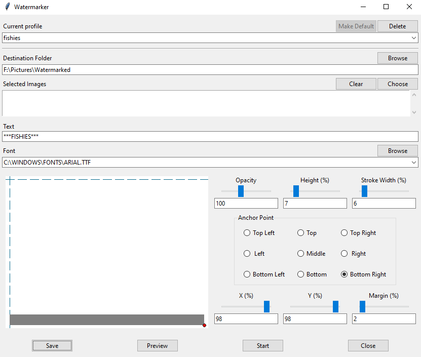

# Watermarker
Watermark images in batches. 

## Installation
### Using the exe files
Copy the file you want to use to where you want it. I'd advise putting it in a dedicated folder, as it will create some extra files for logs and saving preferences.
### Using sources
Copy the source files where you want them.
#### Dependencies
This program requires the following dependencies (I may have missed some):    
- FindSystemFontsFilename
- Pillow

Install these using
    
    pip install <dependency name>

## Usage

Watermarker comes in two versions. A GUI version and a CLI version.

### Graphical user interface

Double clicking on watermarker-gui.py/exe will open this window.

We can see the following components:

- **Destination Folder**: Determines where the watermarked images will be saved. If the folder doesn't exist, it will be created when the watermarking process is started.
- **Selected Images**: Use the 'Choose' button to choose the files that are to be watermarked.
- **Text**: The text used by the watermark.
- **Font**: The font used by the watermark. A font can either be selected from the list of installed fonts available in the combo box, or can be found using the 'Browse' button
- **Opacity**: The opacity of the watermark. Ranges from 0 (opaque) to 255 (transparent).
- **Height**: The relative height of the watermark. Ranges from 0 to 1, where 1 is the total height of the image.
- **Stroke Width**: The width of the stroke used in the watermark. Ranges from 0 to 1.
- **Margin**: The margin to keep between the watermark and the side of the image. Ranges from 0 to 1.
- **Save**: Saves the configuration on screen to a file.
- **Start**: Starts watermarking the selected images using the parameters on screen.
- **Close**: Close the window.

See examples in the command line section for screenshots of outputs.

### Command-line interface

The CLI expects a list of files for it to watermark. This list cane be as long or as short as you want, and can include wildcards. Control over the watermark itself is acheived using various optional parameters.

All documentation below uses the python files. The executables should be called in the command line directly, without going through python.

    $ python watermarker.py -h
        usage: watermarker.py [-h] [-p PROFILE] [-P DEFAULTPROFILE] [--log-level LOGLEVEL] [--default-log-level DEFAULTLOGLEVEL] [-d OUTDIR] [-t TEXT] [-f FONT] [-m MARGIN] [-S STROKEWIDTH] [-H HEIGHT] [-O OPACITY] [-l] [-w [SHOW ...]] [--remove REMOVE [REMOVE ...]] [-s [SAVE]] [input ...]

        Take a list of files and watermark them

        positional arguments:
          input                 Paths to the images that we want to watermark.

        options:
          -h, --help            show this help message and exit

        Global Config:
          Options which affect the program globally

          -p PROFILE, --profile PROFILE
                                Name of an existing profile to use as a default for watermark options. Default: 'Default'
          -P DEFAULTPROFILE, --default-profile DEFAULTPROFILE
                                Change the default profile.
          --log-level LOGLEVEL  Level of detail for logged events. Default: 'WARNING'
          --default-log-level DEFAULTLOGLEVEL
                                Change the default log level

        Watermarking Profile:
          All options that can be saved in a profile. Most of these affect the appearance of the watermark in some way

          -d OUTDIR, --destination-folder OUTDIR
                                Path to the folder containing where the watermarked pictures should go. Default: 'F:\Path\To\Watermarked'.
          -t TEXT, --text TEXT  Text to use as watermark. Default: '@Watermark'.
          -f FONT, --font FONT  Name or path of a font to be used in the watermark. If a name is used, the font must be installed on the system. Default: 'arial.ttf'.
          -m MARGIN, --margin MARGIN
                                Values between 0 and 1. The margin wanted between the watermark and the edge scaled for width and height. Default: 0.0.
          -S STROKEWIDTH, --stroke-width STROKEWIDTH
                                Values between 0 and 1. How thick the stroke should be compared to font size. Default: 0.05.
          -H HEIGHT, --height HEIGHT
                                Values between 0 and 1. How high the text should be relative to the image. Default: 0.02.
          -O OPACITY, --opacity OPACITY
                                Values between 0 and 255. The opacity of the watermark. 0 is opaque, 255 is transparent. Default: 128.

        Profile Management:
          All options allowing management of a profile

          -l, --list-profiles   List the names of all available profiles. The default profile is marked with a star.
          -w [SHOW ...], --show [SHOW ...]
                                Display the options saved in the provided profile
          --remove REMOVE [REMOVE ...]
                                Permanently delete the provided profile.
          -s [SAVE], --save [SAVE]
                                Save the provided profile. If none is given save to the current profile (as set by -p or -P).

#### Example 1: Saving a configuration

Watermarker uses saved configuration profiles to avoid you having to re-specify parameters every time. Each profile contains the configuration for a different watermark. To update the default profile, all that is needed is to specify the -s option. For example if we wanted to change the font to times new roman, we might use
        
    $ python watermarker.py -s -f times.ttf
      Saving Profile 'Default'
      Save successful!

#### Example 2: Saving a configuration in a new profile

Give -s a value if you want to create a new profile or save to a non-default one 

    $python watermarker.py -s timely -f times.ttf
    Saving Profile 'timely'
    Save successful!

#### Example 3: Listing saved profiles 
To see available profiles, use -l. The star indicates the current default profile

    $python watermarker.py -l

    Existing profiles:
    *   1. Default
        2. timely

#### Example 4: Viewing profile details

To show the details of a profile, use -w with or without an argument

    $python watermarker.py -w

    Current Profile:
        Default:
            Text:         @Watermark
            Font:         times.ttf
            Margin:       0.0
            Stroke Width: 0.05
            Height:       0.02
            Opacity:      128
            Destination:  F:\Path\To\Watermarked

#### Example 5: Selecting a profile

Select a profile using -p or -P. If -P is used, it will also save the profile as the new default.

    $python watermarker.py -P timely -l
    New default profile: timely

    Existing profiles:
        1. Default
    *   2. timely

#### Example 6: Watermarking using the default profile

The following command will watermark all .png files in F:\Pictures, using whatever options are saved in the default profile:

    $ python watermarker.py F:\Pictures\*.png
    Watermarking files:
    F:\Pictures\Hay2.png
    F:\Pictures\Screenshot 2024-08-18_1.png
    F:\Pictures\ascii-art.png
    F:\Pictures\hay.png
    Done!

A watermark created using only default values will look like this

#### Example 7: Specify a destination without saving it

If -s isn't specified, an option's value will not be saved. For instance, here we save the watermarked files to a new folder in the working directory called 'fudge', without saving that destination permanently:

    $ python watermarker.py -d fudge F:\Pictures\*.png
    [[WARNING]] Output Folder doesn't exist! Creating it at: fudge
    Watermarking files:
    F:\Pictures\Hay2.png
    F:\Pictures\Screenshot 2024-08-18_1.png
    F:\Pictures\ascii-art.png
    F:\Pictures\hay.png
    Done!

#### Example 8: Full configuration

In this example, we fully configure watermarker text, destination folder, font, margin, stroke width, watermark height, and watermark opacity:

    python watermarker.py -t ***FISHIES*** -d fishies -f times.ttf -m 0.1 -S 0.1 -H 0.1 -O 50 F:\Pictures\*.png
    [[WARNING]] Output Folder doesn't exist! Creating it at: fishies
    Watermarking files:
    F:\Pictures\ascii-art.png
    F:\Pictures\hay.png
    F:\Pictures\Hay2.png
    F:\Pictures\Screenshot 2024-08-18_1.png
    Done!

The parameters used above will make a watermark that looks like this

## Generating the exe files
The exe files can be generated using pyinstaller. In the project root directory, execute:
    
    pyinstaller -F watermarker.py
    pyinstaller -F watermarker-gui.py
